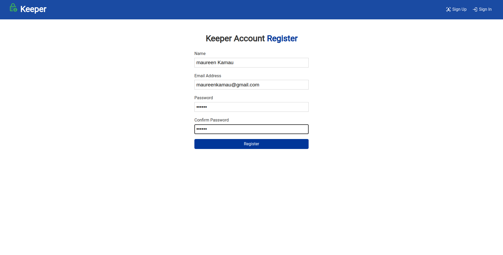
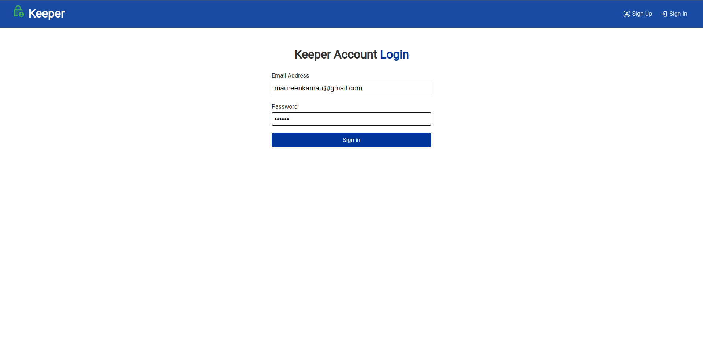
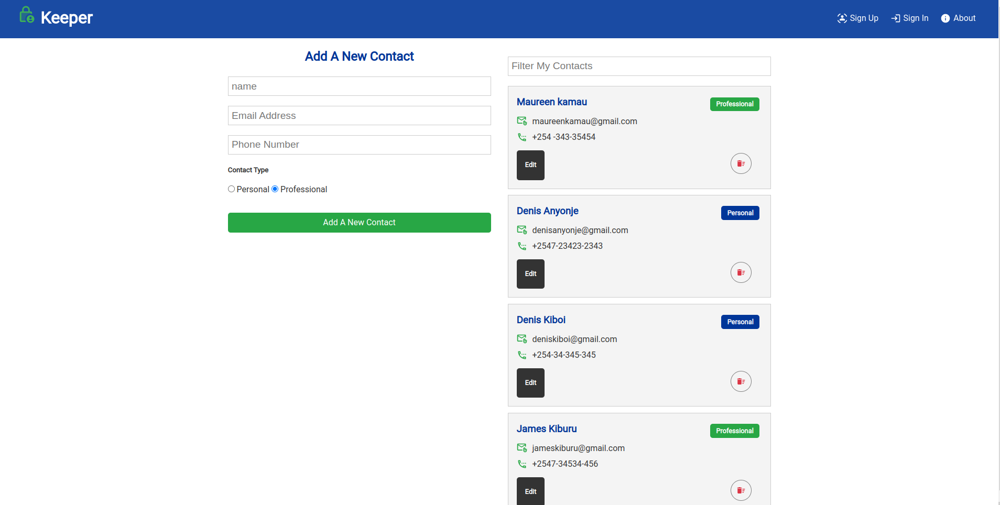
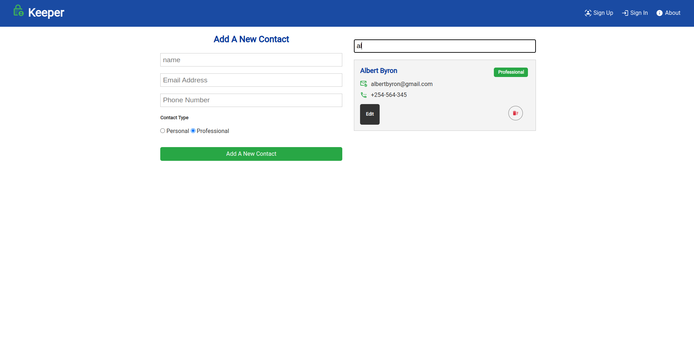
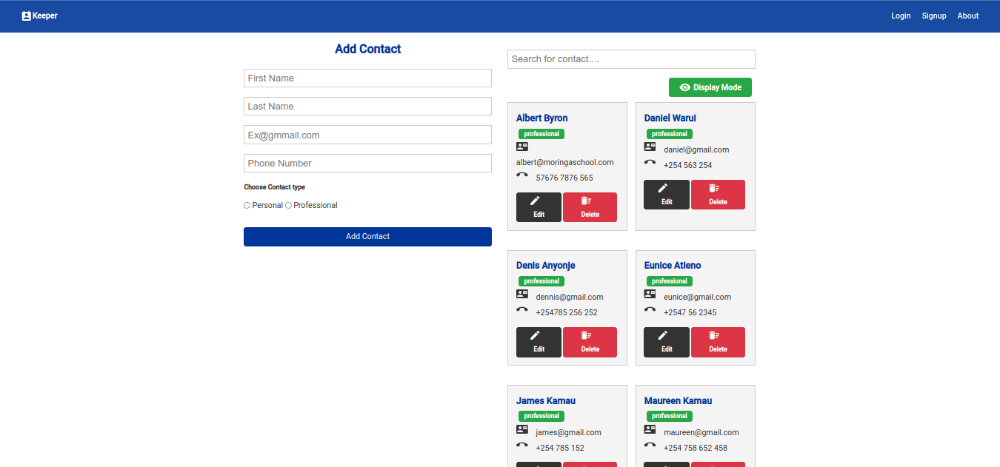

## About The Project

# Project Name

Keeper

## Authors Name

    Denis Ouma Otieno

## Table of contents

- [General info](#general-info)
- [Technologies](#technologies)
- [Setup](#setup)
- [contac](#contact)

## General info

The majority of cell phone users worldwide experience the issue of losing their contact lists due to either phone loss or phone damage, which is why Keeper is being created. Keeper is a free personal information manager that allows you to save all of your friends', families', and colleges' contact information in a single database file. With the built-in ability to login, update and delete, you'll never forget or loose your friends or professional contact number! since you can now access them from any device with an internet connection.

## How To Use The App

The Keeper can only be used by a user who has registered an account.

## How to Use the Website

### stem 1: To get to the page where you register an account, use the navigation in the page's upper left corner. When prompted, enter your credentials as needed and press Enter or click register button.

### step 3: If you already have an account, clicking the sign in button on the navbar will take you to a screen where you must enter both your email and password to access it. according to the picture below

### step 4: A form is provided where you may fill in the name, email, phone number, and choose if the contact is professional or personal. If you already have contacts created, they will be displayed as in the diagram when you log in.

### step 5: As seen in the images below, if you have more than 10 saved contacts, you can search for the person and also edit or delete a contact.

## Technologies

    Project is created with:

        - HTML - Is used to build the structure of the pages.
        - CSS - Is used to style the pages.
        - Angular - Is used to build the reactivity of the page and functionality.
        - JavaScript - Functionality of the website includes, click events and search.
        - Nodjs - The website API is built with Nodejs.
        - MongoDB - All the users data are saved on mongoDB cluster.

## Requirements

-Either a computer, Ipad, tablet or phone -An access to internet connection

## Program Setup

To get started with the frontend of the Phone Book application, follow these steps:

## 1. Clone the repository from GitHub by running the following command in your terminal:

git clone https://github.com/username/phone-book.git

## 2. Navigate to the "client" directory:

cd phone-book/client

## 4. Install the required dependencies:

    npm install

## Usage

To run the application, execute the following command:

    ng serve

This command will start the Angular development server and serve the application at http://localhost:4200. Open your browser and navigate to this URL to access the application.

## Phone Book Application - Backend

This is the backend part of the Phone Book application built with Node.js and Express. It allows the frontend to communicate with the database and perform CRUD operations.

To get started with the backend of the Phone Book application, follow these steps:

## 5. Navigate to the root directory of the project:

    cd phone-book

## 6. Run npm install to install all the packages required:

    npm install

## 7. Create a file called default.json in the config directory:

# To run the backend of the application, execute the following command: make sure you are in the phone-book directory

    npm run server

This command will start the Node.js server and allow the frontend to communicate with the database.

## Contact

    emain: dennisouma38@gmail.com

linkedin:

https://www.linkedin.com/in/denisouma/

## License information

[MIT](LICENCE)

Copyright (c) 2022 Denis Ouma Otieno
